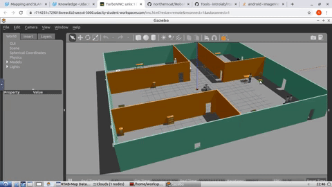
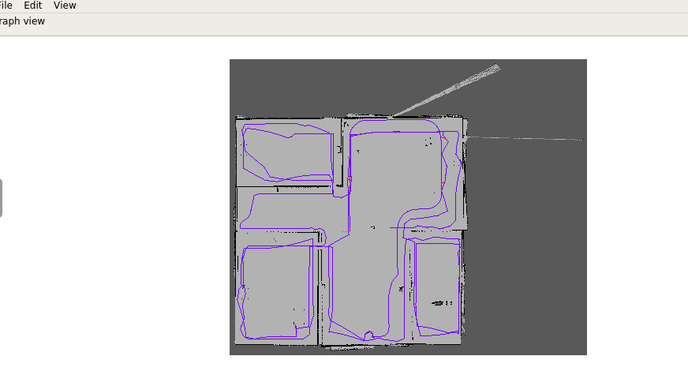
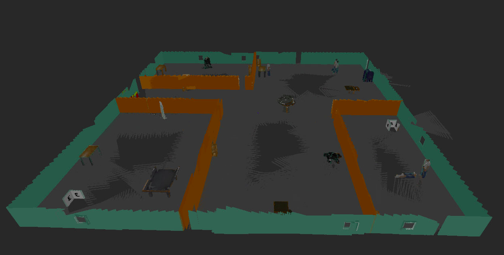

# Udacity Robotic Software NanoDegree
## Where Am I Project

### Introduction
The main objective of this project is to create 2D occupancy grid and 3D octomap from simulated environment using _RTAB-Map ROS Package_

### Motivation
To consolidate the robotic concepts learned in the Udacity Robotics Nanodegree and get a hands-on experience of working with _C++, ROS and Gazebo simulation enviroment_.
 
      
### Prerequisites and Dependencies

#### 1.Install Gazebo>=7.0 and ROS kinetic in Linux.

#### 2. Cmake>=3.0 and gcc/g++>=5.4

#### 3.ROS Navigation Package
      sudo apt-get install ros-kinetic-navigation
       
#### 4.ROS map_server package  
       sudo apt-get install ros-kinetic-map-server 
#### 5.ROS move_base package
       sudo apt-get install ros-kinetic-move-base
#### 6.ROS RTAB-Map  package
       sudo apt-get install ros-kinetic-rtabmap-ros
                

### Build and Run the project

#### 1.Clone and Intialize the catkin workspace.
    
    
       $ mkdir -p catkin_ws
       $ cd catkin_ws/
       $ git clone https://github.com/RamCharanThota/Udacity_Robotic_ND_Proj4_MapMyWorld src
       $ cd catkin_ws/src
       $ catkin_init_workspace 
    
#### 2. Build the packages.
     
     
     $ cd ../
     $ catkin_make
     
     
#### 3. launch robot and world in Gazebo simulation environment.
    
    
    $ source devel/setup.bash
    $ roslaunch my_robot world.launch 
    
#### 4. launch RTABMAp node
     
     
     $ source devel/setup.bash
     $ roslaunch my_robot mapping.launch
     
     
#### 5.run teleop node and Map
      $ rosrun teleop_twist_keyboard teleop_twist_keyboard.py
      teleop node helps you drive the robot arround in the simulated environment using input from keyboard. Navigate your robot in the simulation to create map for the environment! When you are all set, terminate the node and you could find your map db file in the place you specified in the launch file. If you did not modify the argument, it will be located in the /root/.ros/ folder.

#### 6.Visualize Map     
       The resulted maps from RTABMap files can be visualised using rtabmap-databaseViewer tool. This is how you will check for loop closures, generate 3D maps for viewing, extract images, check feature mapping rich zones, and much more! 
       $ rtabmap-databaseViewer ~/.ros/rtabmap.db
#### 7.Results 
      
       

