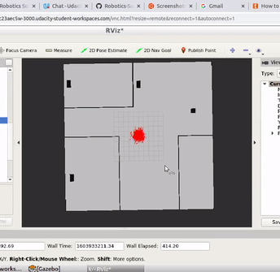

# Udacity Robotic Software NanoDegree
## Where Am I Project

### Introduction
The main objective of this project is to learn to utilize the _ROS AMCL(Adaptive Monte Carlo Localisation)_ package to accurately localize a mobile robot inside a map in the _Gazebo_ simulation environment.and To learn several aspects of robotic software engineering with a focus on ROS:

*Create a ROS package that launches a custom robot model in a custom Gazebo world

*Utilize the ROS AMCL package and the Tele-Operation / Navigation Stack to localize the robot

*Explore, add, and tune specific parameters corresponding to each package to achieve the best possible localization results

### Motivation
To consolidate the robotic concepts learned in the Udacity Robotics Nanodegree and get a hands-on experience of working with _C++, ROS, Gazebo simulation enviroment_.
 
      
### Prerequisites and Dependencies

#### 1.Install Gazebo>=7.0 and ROS kinetic in Linux.

#### 2. Cmake>=3.0 and gcc/g++>=5.4

#### 3.ROS Navigation Package
      sudo apt-get install ros-kinetic-navigation
       
#### 4.ROS map_server package  
       sudo apt-get install ros-kinetic-map-server 
#### 5.ROS move_base package
       sudo apt-get install ros-kinetic-move-base
#### 6.ROS amcl package
       sudo apt-get install ros-kinetic-amcl
                

### Build and Run the project

#### 1.Clone and Intialize the catkin workspace.
    
    
       $ mkdir -p catkin_ws
       $ cd catkin_ws/
       $ git clone https://github.com/RamCharanThota/Udacity_Robotic_ND_Proj3_WhereAmI.git src
       $ cd catkin_ws/src
       $ catkin_init_workspace 
    
#### 2. Build the packages.
     
     
     $ cd ../
     $ catkin_make
     
     
#### 3. launch robot and world in Gazebo simulation environment.
    
    
    $ source devel/setup.bash
    $ roslaunch my_robot world.launch 
    
#### 4. launch amcl node
     
     
     $ source devel/setup.bash
     $ roslaunch my_robot amcl.launch
     
     
#### 5.Drive and Localise 
      You can control or drive  the robot two ways while it localize itself here:
      *control through RViz by using navigation goal
      *control through teleop package where you can drive robot using
      your key board. 
#### 6.Test and Tune     
       while you drive the robot arround you will observe the AMCL node localisation in action. you can tune AMCL node parameters to improve the performace of the algorithm.   

